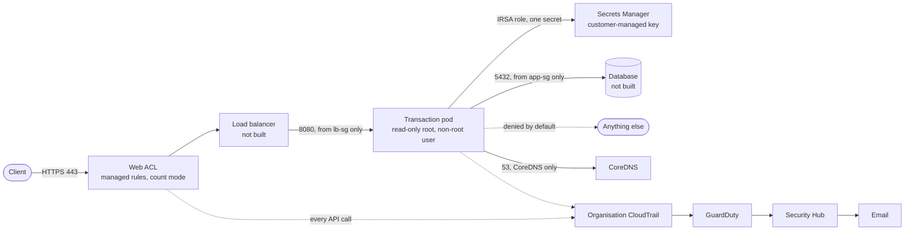

# Architecture

What is built, and why it is shaped this way. The README says what is running; this says what the design is trying to achieve and where the code does not yet match it.

## Why three accounts

The AWS account is the only hard isolation boundary the platform offers. Everything else, IAM policies included, is a decision made inside a blast radius. So the split is by what would be lost:

- **Management** owns the organisation and the guardrails. It should hold nothing else, because service control policies cannot restrain it. A compromise here is a compromise of everything.
- **Security** administers detection and receives alerts. It has no workloads and nothing internet-facing, so it is the account an attacker is least likely to reach.
- **Workloads** runs the application. It has the largest attack surface and therefore the least authority.

The rejected alternative was a single account with tags and IAM boundaries. It is cheaper and simpler, and it fails the only question that matters: an attacker who escalates inside it has everything, including the logs that would have shown what they did.

The AWS reference architecture goes further and splits Security into a Log Archive account and a Security Tooling account, so that the account holding the evidence is not the account running the tools. That split is not implemented here. It is a deliberate simplification at this scale, recorded rather than skipped.

## A transaction, and where it could go wrong

There is no real transaction service yet, so this is the intended path rather than a live one. It is drawn because the control choices only make sense against it.

Each hop is a place to lose control of the transaction, and each has one control that is meant to be the answer:

| Hop | What goes wrong | Answer |
|---|---|---|
| Client to edge | Injection, known bad inputs, floods | managed rule groups, rate limiting, both in count mode today |
| Edge to app | Reaching the app directly, bypassing the edge | app tier accepts 8080 only from the load balancer's security group |
| App identity | A compromised pod reading more than its own secret | IRSA role scoped to one secret ARN and one action |
| App to data | Credential theft, then direct database access | database tier accepts 5432 only from the app tier, and has no egress rules at all |
| App outbound | Exfiltration after a compromise | default-deny egress, DNS to CoreDNS only |
| Everything | Nobody notices | organisation trail, GuardDuty, Security Hub, email |

The database tier having no egress block at all is intentional and worth explaining, because it looks like an omission. Terraform's inline egress rules are authoritative: writing none removes the AWS default of allow-all-outbound rather than leaving it in place. A compromised database cannot open an outbound connection.

## Guardrails

Service control policies do not grant anything. They set a ceiling that local IAM cannot raise, which is what makes them the answer to "the attacker got admin in that account".

Three policies, attached at different levels because they answer different questions:

- **Base guardrails**, at the organisation root: an account may not leave the organisation or close itself.
- **Security-service protection**, on both units: logging and detection may not be stopped, deleted, disconnected or narrowed. Narrowing is the part that matters. A trail that has been updated to record almost nothing still exists and still looks healthy.
- **Region deny**, on both units: resources only in eu-west-1, with the global services excluded, because denying those by region locks an account out of IAM and Organizations with no way back in.

**The gap this design has.** None of it applies to the management account, which holds the organisation, the log bucket, the log key and the Terraform state. What protects that account is root MFA and its IAM configuration, and today it also contains administrator IAM users with long-lived keys that no scanner in this repository can see, because they were made in the console. Moving the log bucket and key into the Security account is the fix for half of it; the other half is operating through Identity Center rather than as an IAM user.

## Evidence and detection

The organisation trail records every account into one bucket, with log-file validation so tampering is detectable and a customer-managed key so reading the bucket is not the same as reading the logs.

GuardDuty and Security Hub are administered from the Security account. That placement is not cosmetic: findings aggregate in the administrator's account, and an EventBridge rule only matches events on its own account's bus. An alert rule left behind in the management account after moving the administrator keeps existing, keeps looking healthy, and never fires again.

What is missing here is continuous verification. Security Hub is on with no standards enabled and no AWS Config behind it, so it relays GuardDuty findings and little else. Nothing currently tells you the landing zone has drifted from this description. That gap is real, and a manual review is what found the CloudTrail encryption problem described in the README.

## Network

One VPC, `10.0.0.0/16`, six `/19` subnets across two availability zones in three tiers: public, private app, private database. Six subnets needed, so three bits borrowed, so `/19`, with two slots left over.

Security groups reference each other rather than CIDR ranges: the load balancer group accepts 443 from anywhere, the app group accepts 8080 from the load balancer group, the database group accepts 5432 from the app group. The chain is then self-documenting and follows instances around automatically, instead of depending on address ranges someone has to remember to update.

There is no NAT gateway in the platform stack. The private tiers have no route to the internet at all. When the cluster needs one, the workload stack creates it and removes it on teardown, because a NAT gateway left running for a month costs most of the budget.

## The cluster

A single-node EKS cluster in the private app subnets, running a placeholder service. The workload is not the point; the controls around it are.

Five layers, chosen so that no two do the same job:

- **Pod Security Standards** at `restricted`, enforced by namespace label. Native to Kubernetes, nothing to install, and it rejects privileged and root containers before any admission controller runs.
- **Kyverno** for the two things the standards do not cover: resource requests and limits must be set, and images must come from an approved registry. Deliberately not re-implementing what Pod Security Standards already enforces.
- **Network policies**, default-deny in both directions, with DNS egress scoped to CoreDNS rather than port 53 anywhere. The narrow scoping matters: DNS to any destination is a working exfiltration channel that a default-deny policy will not catch, because it is, technically, DNS.
- **IRSA**, with the role's trust policy scoped on both the service account subject and the audience, so the role is usable by one service account in one cluster and nothing else.
- **Image scanning** with Trivy.

All five were tested by trying to violate them rather than by confirming they existed. One of the five was not working at all. See `evidence/2026-08-09-cluster-control-tests.md`.

## Two stacks

The platform stack in `infra/` is long-lived. The cluster stack in `infra/workload/` is created for a test and destroyed the same day.

They are separate root modules with separate state because Kubernetes objects cannot be planned before the cluster API exists: manifests validate against the live cluster's schema during plan, and the Kubernetes provider is configured from an endpoint that does not exist yet. Held in one module, `terraform plan` failed outright whenever the cluster was down, which is nearly always. Ordering cannot fix it, because the failure happens before apply.

The boundary is the platform's outputs, kept deliberately short: an output is a promise to another stack.

## Where the code does not match this document

Kept current on purpose, because a design document that quietly diverges from the code is worse than none.

- The log bucket and its key are in the management account, not the Security account. The document above says why that is wrong and what the fix is.
- The log bucket has versioning but no deny statement and no object lock, so deletion is prevented by IAM alone.
- The web ACL is attached to nothing, because there is no load balancer.
- The database tier, the load balancer and the real transaction service do not exist.
- Security Hub has no standards enabled.
