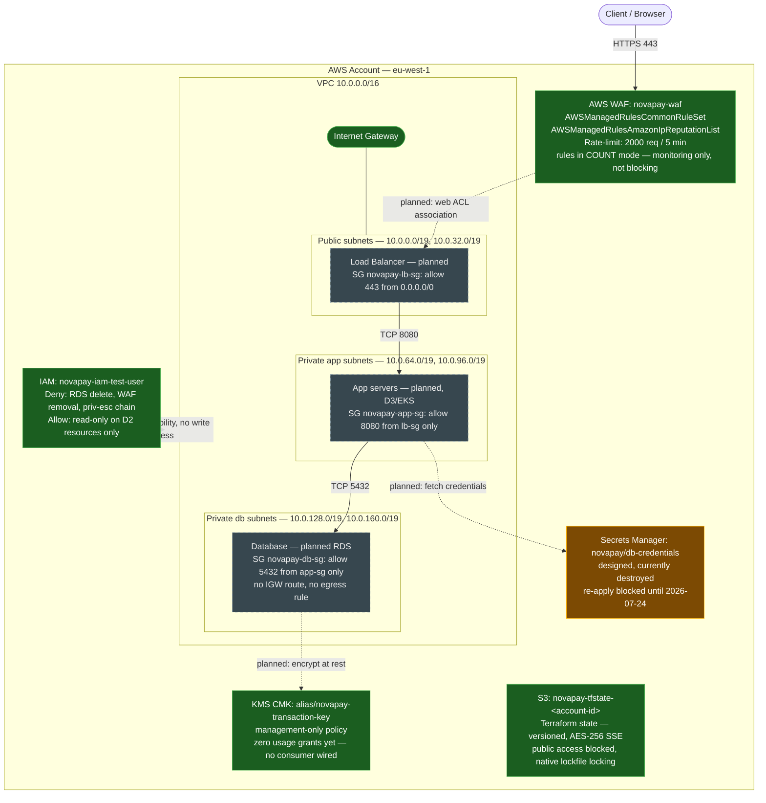

# NovaPay — Reference Architecture (D2)

Diagram reflects infra state as of 2026-07-21. Renders natively on GitHub/Obsidian (Mermaid) — no build step, edit the code block below whenever the Terraform changes.

**Legend:** green = applied & live in AWS · gray dashed = planned, not yet provisioned (D3+) · orange = designed but currently destroyed (cost/scope decision, re-apply pending).

