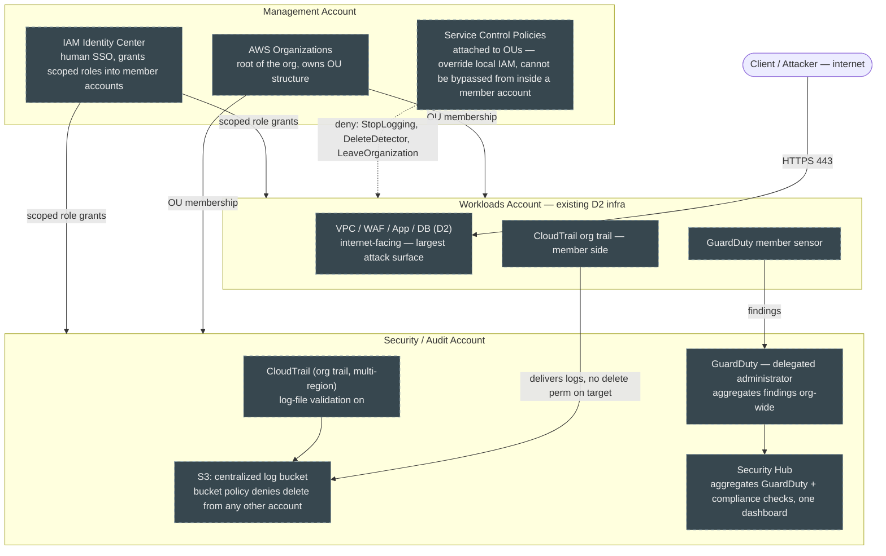

# NovaPay — Secure Landing Zone (D1)

**Status: design-only, nothing applied yet.** This diagram is drawn *before* the first `terraform apply` for D1 (senior-engineer standing rule #2 — design before build), and reflects the account structure we agreed on: **Option Γ — Management + Security/Audit + Workloads**.

**Legend:** gray dashed = planned/design, nothing live yet in AWS. Solid arrows = "communicates with / feeds into." Dotted arrows = "constrains / denies regardless of local IAM."

## Τι αντιμετωπίζει ένας attacker, βήμα-βήμα

1. **Είσοδος** — στοχεύει το **Workloads account** (μεγαλύτερη επιφάνεια: WAF/app/DB εκτεθειμένα στο internet). Ας υποθέσουμε ότι πετυχαίνει αρχικό compromise (π.χ. leaked credential, app vulnerability).
2. **Κλιμάκωση δικαιωμάτων μέσα στο account** — μπλοκάρεται από το IAM least-privilege του D2 *και ανεξάρτητα* από τα SCPs του D1, που ισχύουν ό,τι κι αν λέει το τοπικό IAM.
3. **Προσπάθεια συγκάλυψης ιχνών** (σβήσιμο CloudTrail, απενεργοποίηση GuardDuty) — αποτυγχάνει διπλά:
   - Τα logs ζουν σε S3 bucket σε **άλλο account** (Security/Audit) — το Workloads account δεν έχει delete δικαίωμα εκεί, ό,τι κι αν καταφέρει τοπικά.
   - Το SCP απαγορεύει ρητά `cloudtrail:StopLogging` / `guardduty:DeleteDetector`, ανεξάρτητα από το αν το τοπικό IAM θα το επέτρεπε.
4. **Ανίχνευση** — το GuardDuty τρέχει σε account που ο attacker ποτέ δεν παραβίασε· σημαίνει ασυνήθιστη συμπεριφορά, το Security Hub το συγκεντρώνει σε μία οθόνη.
5. **Η μόνη «νίκη» που θα του απέμενε** — να παραβιάσει απευθείας το Management ή το Security account. Πολύ μικρότερη επιφάνεια: καμία δημόσια έκθεση, πρόσβαση μόνο μέσω IAM Identity Center SSO.
