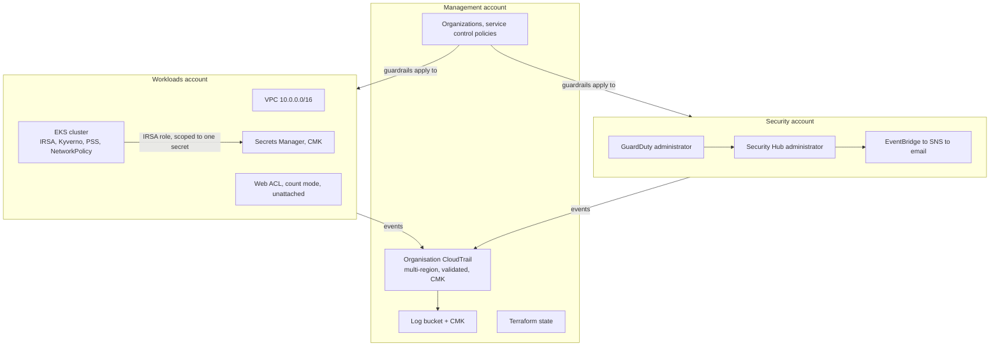

# NovaPay secure platform

A multi-account AWS landing zone and a hardened Kubernetes workload, written in Terraform, with a compliance pipeline that blocks non-conforming infrastructure before it is applied.

NovaPay is an invented EU payments company. The regulatory framing is real: under DORA a compliance claim has to correspond to something that runs. That constraint drove the design, and it is also why this README separates what is running from what is only written down.

This is a lab built to learn on, applied against real AWS accounts and torn down between tests to stay inside a 40 EUR monthly budget. It is not production, and the limits section says exactly where it falls short.

## What is actually running

Two kinds of row, because they are two different claims. `live` means it exists in
AWS right now. `written` means the Terraform is in this repository and passes
`validate`, `fmt` and the policy suite, but no `apply` has put it into an
account yet. The second group is the work of the current hardening branch.

| Control | State |
|---|---|
| AWS Organizations, three accounts, two organisational units | live |
| Organisation CloudTrail, multi-region, log-file validation | live |
| CloudTrail encrypted with a customer-managed key | written, not applied |
| Service control policy: workload guardrails on the Workloads unit | live |
| Service control policies: base guardrails at the root, security-service protection and region deny on both units | written, not applied |
| GuardDuty and Security Hub, enabled organisation-wide | live, administered from the management account |
| GuardDuty and Security Hub, administered from the Security account | written, not applied |
| S3 protection and malware protection, enabled through organisation configuration | written, not applied |
| IAM Identity Center with an administrator permission set | live |
| HIGH and CRITICAL findings emailed through EventBridge and SNS | live, moves to the Security account with the detection change |
| Account baseline: public access block, password policy, Access Analyzer, EBS encryption, security contact | written, not applied |
| VPC across two availability zones, three subnet tiers, chained security groups | live |
| Two customer-managed KMS keys, both rotating | live |
| Secrets Manager secret encrypted with a customer-managed key | written, not applied |
| Terraform state in S3, versioned, locked, public access blocked | live |
| Compliance pipeline on every pull request | live, both check runs green on PR #1 |
| EKS cluster, IRSA, Kyverno, Pod Security Standards, network policies | built and tested, destroyed after each test |
| Web ACL, managed rule groups in count mode | live, attached to nothing, and 60 percent of the bill |
| Backup and restore with a tested restore | not built, see limits |

The written rows are not a wish list. They are the fixes for problems a review
found in what was already live, and the reason they are not applied yet is that
moving detection between accounts cannot be done in one step: see
`docs/runbooks/move-detection-to-security-account.md`. Applying them is the next
change to this repository, and this table moves with it.

## Architecture

Three accounts, because the account is AWS's only hard security boundary. The management account owns the organisation and nothing else worth stealing. The Security account administers detection and receives the alerts. Workloads holds everything that runs.



Service control policies do not apply to the management account. That is the single most important thing to understand about this diagram, and it is why detection and alerting live in the Security account rather than next to the organisation.

The diagram is the design as this repository defines it. The detection block sits in the Security account here; in AWS today it is still in the management account, which is the gap the table above marks as written and not applied.

## What broke

The most useful part of this repository. Each of these was found by testing something, not by reading about it.

**Network policies were silently doing nothing.** The default-deny and DNS-only egress policies existed in the cluster and were accepted by the API. An HTTPS request from a pod that should have been blocked succeeded. The VPC CNI does not enforce NetworkPolicy objects unless `enableNetworkPolicy` is set on the add-on. Everything else tested that day worked from the start; this one looked identical to working.

**A fix that was recorded as done and never took effect.** The decision log said the trail had been moved from SSE-S3 to a customer-managed key in August. Only the bucket default had changed. CloudTrail sets the encryption on its own PutObject call, and the per-object choice beats the bucket default, so every log written for the next month was still SSE-S3. One `head-object` would have caught it at the time. The baseline capture in `evidence/` is that check, run a month late.

**Deleting the branches did not delete the leaked commits.** Two branches containing real account root emails were squash-merged and deleted before the repository was made public, and that was recorded as closing the exposure. GitHub keeps unreachable commits fetchable by SHA, and publishes those SHAs through its own events API. The commits were still being served. The reasoning failed because a claim about an external system was accepted without testing it against that system.

**A policy rule that passed an open SSH port.** The rule looked correct and returned no findings against a security group allowing port 22 from anywhere. The HCL parser represents a single `ingress` block as an object and several as a list, so iterating the object walked field values rather than rules. It would have started working by accident the day someone added a second block. The fixture that catches this now exists because of it.

**The repository could not be planned.** `terraform plan` failed on a clean checkout whenever the cluster was down, which is most of the time. Kubernetes manifests validate against the live cluster's schema during plan, and the provider is configured from an endpoint that does not exist yet. No amount of `depends_on` helps, because it fails before apply. The cluster is now a separate stack, which is what the two things were in practice all along.

**A cluster version that was already out of support.** The first guess, 1.30, was past both standard and extended support on the day it was chosen. `aws eks describe-cluster-versions` is the answer; memory is not.

**A KMS key policy that could not delete its own alias**, and an apply that failed because the provider calls `UpdateKeyDescription` before `PutKeyPolicy` within a single run.

## Cost

August, excluding tax:

| Item | USD |
|---|---|
| Web ACL | 8.89 |
| Everything else | 5.87 |
| Total | 14.76 |

The web ACL was 60 percent of the bill while protecting nothing, because there is no load balancer to attach it to. It has been moved into the workload stack in code, so that it comes up and goes down with the thing it fronts, but the applied one is still running and still billing until the wind-down below. The EKS control plane bills roughly 0.10 USD per hour whenever the cluster exists, which is why the cluster is a same-day resource.

A two-threshold budget alarm was created before any billable resource.

## Winding it down

Most of this landing zone is free: the organisation, the accounts and units, the service control policies, Identity Center, the VPC and its subnets, the budget alarm. The VPC is free precisely because the NAT gateway sits in the workload stack. What costs money is the web ACL, two customer-managed keys, GuardDuty, Security Hub and the log bucket, and none of that has to stay running for the code to be worth reading.

So the plan is to remove what bills and keep what does not, rather than run `terraform destroy`. That command is the wrong one here for a reason worth knowing: `aws_organizations_account` on destroy does not close an account, it removes it from the organisation, and the member email addresses cannot then be reused. It would trade the most substantial part of this estate for no saving at all.

`docs/runbooks/wind-down-billable-resources.md` is that procedure, including the two things that catch people out. The log bucket is versioned and sets no `force_destroy`, so Terraform cannot remove it until the object versions and delete markers are gone. And the keys and the secret both carry a seven-day window, so they are scheduled rather than deleted and keep billing for a week after Terraform reports them destroyed.

The table above moves in the same change as the runbook runs. A row that still says `live` afterwards would break the promise this README opens with.

## Running it

Two stacks, in order. The platform is long-lived; the workload is created for a test and destroyed after.

```
cd infra
terraform init -backend-config=backend.hcl
terraform apply

cd workload
terraform init -backend-config=../backend.hcl
terraform apply -var platform_state_bucket=<bucket> -var 'operator_cidrs=["<your ip>/32"]'
```

`infra/backend.hcl` holds the state bucket name and is not committed; see `infra/backend.hcl.example`. Copy `infra/terraform.tfvars.example` to `infra/terraform.tfvars` and fill in the email addresses and the security contact number.

Tear the workload down the same day:

```
terraform destroy
```

If you are applying the platform stack for the first time since the detection services moved accounts, read `docs/runbooks/move-detection-to-security-account.md` first. That change cannot be applied in one step, because moving a resource between accounts in Terraform is a destroy and a create rather than an edit.

State here was last written by the code from before that move, so `terraform plan` against `main` fails on a refresh it is not allowed to perform. That is expected, and both runbooks start by checking out the `pre-detection-move` tag, which is the commit whose addresses still match what is in state.

## The compliance pipeline

Every pull request runs `terraform fmt` and `validate` on both stacks, then Checkov, Trivy, gitleaks and seven Conftest policies, uploads SARIF to code scanning and writes a summary table. Nothing in it needs AWS credentials.

Each policy names the DORA article it evidences. `policy/README.md` lists them, and lists the four articles this project deliberately does not claim, including backup and restore, which requires a tested restore that has never been run here.

## Limits

Stated plainly, because a lab that claims to be more than it is fails the first real question.

- **DORA compliance is not claimed.** This evidences a subset of the technical controls in Articles 9 and 10. Compliance is organisational and a solo project cannot reach it.
- **No tested restore.** State is versioned in S3 and there is no data tier yet. Article 12 wants restore procedures exercised periodically; nothing here has been restored, so nothing is claimed.
- **No AWS Config, so no continuous benchmark.** Security Hub is enabled with no standards behind it, which means it aggregates GuardDuty and little else. Today, verification that the landing zone still matches CIS is manual, and a manual review is what found the CloudTrail problem above.
- **The transaction service is a placeholder.** It is nginx. The interesting object is the set of controls around it, not the workload.
- **The web ACL has never blocked anything.** Rules are in count mode and it is attached to nothing.
- **The log bucket and its key live in the management account**, not a dedicated log archive account. That is a deliberate simplification of the AWS reference architecture at this scale, and it means the logs sit in the one account service control policies cannot govern.
- **No VPC flow logs.** Nothing here records which address talked to which. Delivering them means a cross-account write into the management-account log bucket, which means widening the bucket policy that protects the audit trail, and that is a decision rather than an attribute. It is the largest single gap in what this estate can reconstruct after an incident.
- **The state bucket is encrypted with SSE-S3, not a customer-managed key.** State holds a generated database password in clear text, so this is a real weakness and not a stylistic one. It is deferred because a CMK on the state bucket is the one encryption change that can lock you out of your own state, and doing it safely is a runbook: create the key, grant access, prove a read, then switch the bucket default.
- **One root account still lacks MFA.** Tracked, not forgotten.

## Layout

```
infra/              platform stack: organisation, accounts, logging, detection, network
infra/workload/     cluster stack: EKS, workload, admission policies, web ACL
policy/             Conftest rules, DORA mapping, and the fixture that proves they fire
docs/runbooks/      procedures that cannot be a single terraform apply
evidence/           terminal captures kept as proof a control behaved as described
SECURITY_DECISIONS.md   every decision, with what was rejected and why
THREAT_MODEL.md     assets, attackers, paths, mapped to STRIDE and OWASP
```
