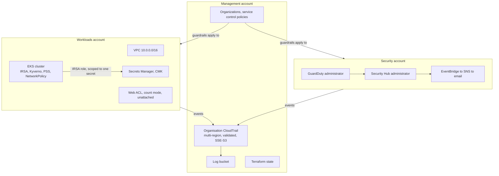

# NovaPay secure platform

A multi-account AWS landing zone and a hardened Kubernetes workload, written in Terraform, with a compliance pipeline that blocks non-conforming infrastructure before it is applied.

NovaPay is an invented EU payments company. The regulatory framing is real: under DORA a compliance claim has to correspond to something that runs. That constraint drove the design, and it is also why this README separates what is running from what is only written down.

This is a lab built to learn on, applied against real AWS accounts and torn down between tests to stay inside a 40 EUR monthly budget. It is not production, and the limits section says exactly where it falls short.

## What is actually running

Three kinds of row, because they are three different claims.

- **`live`** means it exists in AWS right now.
- **`written`** means the Terraform is in this repository and passes `validate`,
  `fmt` and the policy suite, but no `apply` ever put it into an account.
- **`wound down`** means it was applied, it ran, it was verified, and it was
  then deliberately destroyed on 2026-09-06 to stop paying for it. Those rows
  are not aspirations and not failures. The read-back proving each one ran is
  in `evidence/2026-09-06-pre-winddown.txt`, captured hours before the teardown.

| Control | State |
|---|---|
| AWS Organizations, three accounts, two organisational units | live |
| Organisation CloudTrail, multi-region, log-file validation | live |
| CloudTrail encrypted with a customer-managed key | dropped 2026-09-11: the key never encrypted a log object, trail now honestly uses SSE-S3 |
| Service control policy: workload guardrails on the Workloads unit | live |
| Service control policies: base guardrails at the root, security-service protection and region deny on both units | written, never applied |
| GuardDuty and Security Hub, enabled organisation-wide | wound down 2026-09-06 |
| GuardDuty and Security Hub, administered from the Security account | written, never applied |
| S3 protection and malware protection, enabled through organisation configuration | written, never applied |
| IAM Identity Center with an administrator permission set | live |
| HIGH and CRITICAL findings emailed through EventBridge and SNS | rule and topic still exist; nothing can fire them since detection was wound down |
| Account baseline: public access block, password policy, Access Analyzer, EBS encryption, security contact | written, never applied |
| VPC across two availability zones, three subnet tiers, chained security groups | live |
| Customer-managed KMS key for the log bucket, rotating | wound down 2026-09-11 (scheduled for deletion, 7-day window to 2026-09-18); it existed but never actually encrypted a log object, see below |
| Customer-managed KMS key for application data, rotating | wound down 2026-09-06 |
| Secrets Manager secret | wound down 2026-09-06, and never re-encrypted with the customer-managed key |
| Terraform state in S3, versioned, locked, public access blocked | live |
| Compliance pipeline on every pull request | live, both check runs green on PR #1 |
| EKS cluster, IRSA, Kyverno, Pod Security Standards, network policies | built and tested, destroyed after each test |
| Web ACL, managed rule groups in count mode | wound down 2026-09-06, having been attached to nothing and 60 percent of the bill |
| The D2 test IAM user and its long-lived access key | wound down 2026-09-06 |
| Backup and restore with a tested restore | not built, see limits |

The written rows are not a wish list. They are the fixes for problems a review
found in what was already live. They stayed unapplied because moving detection
between accounts cannot be done in one step, which
`docs/runbooks/move-detection-to-security-account.md` sets out, and then the
estate was wound down instead of hardened. That was a cost decision, taken
deliberately and recorded rather than left to drift: see
`docs/runbooks/wind-down-billable-resources.md`.

What is left running costs about 1.30 USD a month and is almost entirely free
tier: the organisation and its accounts, the service control policy, Identity
Center, the VPC, the state bucket, and the organisation CloudTrail with its
key. The trail stayed on purpose. It carries `prevent_destroy`, and a control
you have deliberately guarded is not one to switch off to save a euro.

## Architecture

Three accounts, because the account is AWS's only hard security boundary. The management account owns the organisation and nothing else worth stealing. The Security account administers detection and receives the alerts. Workloads holds everything that runs.



Service control policies do not apply to the management account. That is the single most important thing to understand about this diagram, and it is why detection and alerting live in the Security account rather than next to the organisation.

The diagram is the design as this repository defines it, not a picture of AWS today. The detection block sits in the Security account here; it was never moved there, it ran from the management account for its whole life, and on 2026-09-06 it was wound down. The Security account still exists and still receives no detection, because there is none left to receive.

## What broke

The most useful part of this repository. Each of these was found by testing something, not by reading about it.

**Network policies were silently doing nothing.** The default-deny and DNS-only egress policies existed in the cluster and were accepted by the API. An HTTPS request from a pod that should have been blocked succeeded. The VPC CNI does not enforce NetworkPolicy objects unless `enableNetworkPolicy` is set on the add-on. Everything else tested that day worked from the start; this one looked identical to working.

**A fix that was recorded as done and never took effect.** The decision log said the trail had been moved from SSE-S3 to a customer-managed key in August. Only the bucket default had changed. CloudTrail sets the encryption on its own PutObject call, and the per-object choice beats the bucket default, so every log written for the next month was still SSE-S3. One `head-object` would have caught it at the time. The baseline capture in `evidence/` is that check, run a month late. Resolved 2026-09-11 by a five-agent review: rather than chase the `UpdateKeyDescription`/`PutKeyPolicy` apply-order bug below to make the CMK actually take effect, the key was scheduled for deletion instead, since it was costing roughly 1-2 USD a month for a control that had never once run. The trail keeps SSE-S3, which is what it was always actually doing.

**Deleting the branches did not delete the leaked commits.** Two branches containing real account root emails were squash-merged and deleted before the repository was made public, and that was recorded as closing the exposure. GitHub keeps unreachable commits fetchable by SHA, and publishes those SHAs through its own events API. The commits were still being served. The reasoning failed because a claim about an external system was accepted without testing it against that system.

**A policy rule that passed an open SSH port.** The rule looked correct and returned no findings against a security group allowing port 22 from anywhere. The HCL parser represents a single `ingress` block as an object and several as a list, so iterating the object walked field values rather than rules. It would have started working by accident the day someone added a second block. The fixture that catches this now exists because of it.

**The repository could not be planned.** `terraform plan` failed on a clean checkout whenever the cluster was down, which is most of the time. Kubernetes manifests validate against the live cluster's schema during plan, and the provider is configured from an endpoint that does not exist yet. No amount of `depends_on` helps, because it fails before apply. The cluster is now a separate stack, which is what the two things were in practice all along.

**A threat model that marked absent controls as live.** The B2 table claimed five enforced guardrails. Read back from the organisation rather than from the code, one was accurate, two covered a narrower scope than claimed, and two described policy that had never been applied at all, including the region deny. The Security account turned out to carry no service control policy whatsoever. Worst of the five: `ARCHITECTURE.md` argues that narrowing a trail is the failure that matters, because an updated trail still looks healthy, and the policy answering it denies `StopLogging` and `DeleteTrail` while saying nothing about `UpdateTrail`. Nothing in the pipeline could have caught this. Checkov and Conftest read the Terraform that was written, and the written policy was correct; it was never applied, and no scanner in this repository reads an organisation.

**A cluster version that was already out of support.** The first guess, 1.30, was past both standard and extended support on the day it was chosen. `aws eks describe-cluster-versions` is the answer; memory is not.

**A KMS key policy that could not delete its own alias**, and an apply that failed because the provider calls `UpdateKeyDescription` before `PutKeyPolicy` within a single run.

## Cost

August, excluding tax:

| Item | USD |
|---|---|
| Web ACL | 8.89 |
| Everything else | 5.87 |
| Total | 14.76 |

The web ACL was 60 percent of the bill while protecting nothing, because there is no load balancer to attach it to. It was moved into the workload stack in code, so that it would come up and go down with the thing it fronts, and the applied one was destroyed in the wind-down below. The EKS control plane bills roughly 0.10 USD per hour whenever the cluster exists, which is why the cluster is a same-day resource.

After the wind-down the estate bills about **1.30 USD a month**: one customer-managed key for the log bucket, and storage for that bucket and the state bucket. Everything else still running is free tier. The figure reaches that a week after the teardown rather than the next day, because the key destroyed on 2026-09-06 was scheduled for deletion with a seven-day window and bills for the whole of it.

A two-threshold budget alarm was created before any billable resource, and it is still running.

## Winding it down

Done on 2026-09-06, and the interesting part is what was kept.

Most of this landing zone is free: the organisation, the accounts and units, the service control policy, Identity Center, the VPC and its subnets, the budget alarm. The VPC is free precisely because the NAT gateway sits in the workload stack. So an untargeted `terraform destroy` would have saved nothing and cost a great deal, because `aws_organizations_account` on destroy does not close an account. It removes it from the organisation, and the member email addresses cannot then be reused. The wind-down targeted what billed and left the rest.

`docs/runbooks/wind-down-billable-resources.md` is the procedure. Four things in it were learned by running it rather than by planning it, and the runbook carries each one because the first version had it wrong.

**A pending rename cannot be half covered by `-target`.** `main` renames `aws_guardduty_detector.main` to `.management` and `aws_securityhub_account.main` to `.management`. Terraform refuses a targeted plan that honours a `moved` block for some instances and not others, which is right: the result would match neither the old state nor the new configuration.

**Order beats intent for delegated administrators.** Deleting the GuardDuty detector failed with *you must first disassociate your member accounts*, and Security Hub with *cannot disable Security Hub on the Security Hub administrator*. Both are the same mistake: the organisation layer has to be dismantled before the service it administers. Once the delegated administrator registrations were gone, the detector and the hub deleted in under a second each, after one of them had spent five minutes failing.

**`prevent_destroy` did its job.** The trail, its bucket, its key, the state bucket and both member accounts carry it. It stopped the teardown and forced the question of whether the audit trail was worth a euro a month. It was, so the trail is still running.

**The evidence capture is a bash script.** Run from PowerShell it produces an empty file and puts the error where the redirect cannot catch it, which is indistinguishable from success until the file is opened. That nearly destroyed the logs with nothing to show they had ever existed.

Two things billed for a week after Terraform reported them gone: both the key and the secret carry a seven-day window and are scheduled, not deleted.

## Running it

Two stacks, in order. The platform is long-lived; the workload is created for a test and destroyed after.

```
cd infra
terraform init -backend-config=backend.hcl
terraform apply

cd workload
terraform init -backend-config=../backend.hcl
terraform apply -var platform_state_bucket=<bucket> -var 'operator_cidrs=["<your ip>/32"]'
```

`infra/backend.hcl` holds the state bucket name and is not committed; see `infra/backend.hcl.example`. Copy `infra/terraform.tfvars.example` to `infra/terraform.tfvars` and fill in the email addresses and the security contact number.

Tear the workload down the same day:

```
terraform destroy
```

If you are applying the platform stack for the first time since the detection services moved accounts, read `docs/runbooks/move-detection-to-security-account.md` first. That change cannot be applied in one step, because moving a resource between accounts in Terraform is a destroy and a create rather than an edit.

State here was last written by the code from before that move, so `terraform plan` against `main` fails on a refresh it is not allowed to perform. That is expected, and both runbooks start by checking out the `pre-detection-move` tag, which is the commit whose addresses still match what is in state.

## The compliance pipeline

Every pull request runs `terraform fmt` and `validate` on both stacks, then Checkov, Trivy, gitleaks and seven Conftest policies, uploads SARIF to code scanning and writes a summary table. Nothing in it needs AWS credentials.

Each policy names the DORA article it evidences. `policy/README.md` lists them, and lists the four articles this project deliberately does not claim, including backup and restore, which requires a tested restore that has never been run here.

## Limits

Stated plainly, because a lab that claims to be more than it is fails the first real question.

- **DORA compliance is not claimed.** This evidences a subset of the technical controls in Articles 9 and 10. Compliance is organisational and a solo project cannot reach it.
- **No tested restore.** State is versioned in S3 and there is no data tier yet. Article 12 wants restore procedures exercised periodically; nothing here has been restored, so nothing is claimed.
- **No continuous verification at all, since the wind-down.** Security Hub ran with no standards behind it, so it aggregated GuardDuty and little else, and both are now gone. Checking that the landing zone still matches CIS was already manual; it is now the only option. A manual review is what found the CloudTrail problem above, which is the argument for and against this in one sentence.
- **The transaction service is a placeholder.** It is nginx. The interesting object is the set of controls around it, not the workload.
- **The web ACL never blocked anything.** Its rules were in count mode and it was attached to nothing for its entire life, at 7.75 USD a month. It is the clearest thing in this repository about the difference between a control that exists and a control that works.
- **The log bucket and its key live in the management account**, not a dedicated log archive account. That is a deliberate simplification of the AWS reference architecture at this scale, and it means the logs sit in the one account service control policies cannot govern.
- **No VPC flow logs.** Nothing here records which address talked to which. Delivering them means a cross-account write into the management-account log bucket, which means widening the bucket policy that protects the audit trail, and that is a decision rather than an attribute. It is the largest single gap in what this estate can reconstruct after an incident.
- **The state bucket is encrypted with SSE-S3, not a customer-managed key.** State holds a generated database password in clear text, so this is a real weakness and not a stylistic one. It is deferred because a CMK on the state bucket is the one encryption change that can lock you out of your own state, and doing it safely is a runbook: create the key, grant access, prove a read, then switch the bucket default.
- **One root account still lacks MFA.** Tracked, not forgotten.

## Layout

```
infra/              platform stack: organisation, accounts, logging, detection, network
infra/workload/     cluster stack: EKS, workload, admission policies, web ACL
policy/             Conftest rules, DORA mapping, and the fixture that proves they fire
docs/runbooks/      procedures that cannot be a single terraform apply
evidence/           terminal captures kept as proof a control behaved as described
SECURITY_DECISIONS.md   every decision, with what was rejected and why
THREAT_MODEL.md     assets, attackers, paths, mapped to STRIDE and OWASP
```
