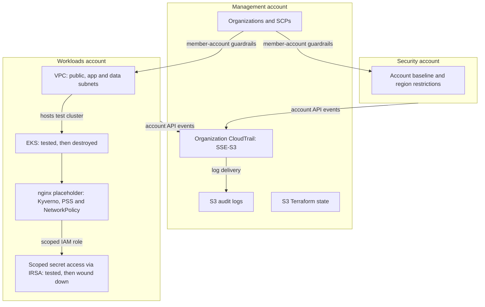
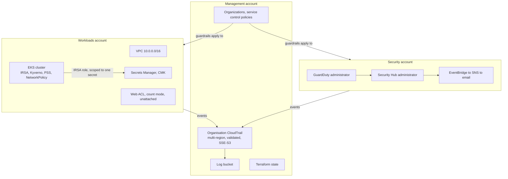

# NovaPay secure platform

## Overview

NovaPay is a cloud-security lab for a fictional payments company. I built a three-account AWS environment in Terraform, tested security controls around a Kubernetes workload, and added a pull-request pipeline for infrastructure checks.

The workload is a placeholder nginx service, not a payment application. Resources were deployed to real AWS accounts and billable test resources were later torn down. The evidence records what ran, what failed and what was never deployed; this README does not claim production readiness or DORA compliance.

[Architecture](#architecture) ? [Evidence and results](#key-findings--results) ? [Lessons](#what-i-learned) ? [Reproduce](#how-to-deploy--reproduce)

## Architecture

The account boundary separates organization administration from workloads. The diagram shows the implemented layout and the historical EKS test environment. Status labels refer to the dated evidence, not a fresh AWS inventory.



SCPs do not restrict the management account. GuardDuty and Security Hub ran there before being wound down on 6 September 2026; their planned migration to the Security account was never applied. The [detailed control inventory](#recorded-control-status) distinguishes deployed, destroyed and code-only controls.

## Technologies Used

| Technology | Role in this project |
|---|---|
| AWS Organizations, SCPs and IAM | Account separation, organization guardrails and workload permissions |
| Terraform | Separate platform and workload stacks |
| CloudTrail and S3 | Organization audit trail, log storage and remote Terraform state |
| EKS, IRSA, Kyverno and Kubernetes NetworkPolicy | Tested workload identity, admission and network restrictions |
| GitHub Actions, Checkov, Gitleaks and Conftest/OPA | Infrastructure checks and custom Rego policies on pull requests |
| Trivy | Advisory configuration scanning and a recorded container image scan |

## What This Project Demonstrates

| Capability | Evidence |
|---|---|
| Verify organization guardrails from member accounts | [Allowed and denied region calls after applying SCPs](evidence/2026-09-11-scps-and-account-baseline.txt) |
| Test Kubernetes controls with deliberate violations | [Admission rejections, scoped secret access and the NetworkPolicy correction](evidence/2026-08-09-cluster-control-tests.md) |
| Run infrastructure checks without AWS credentials | [Recorded GitHub check results](evidence/2026-09-06-pipeline-first-github-run.txt) and [workflow](.github/workflows/compliance.yml) |
| Verify resource state after teardown | [Post-wind-down AWS read-back](evidence/2026-09-06-post-winddown.txt) and [later billing investigation](evidence/2026-09-14-budget-alert-investigation.txt) |

## How to Deploy / Reproduce

Start with the credential-free checks from the repository root. These commands do not deploy resources. They require Terraform 1.10.5 and Conftest 0.56.0, matching the [workflow](.github/workflows/compliance.yml), plus network access to download Terraform providers and modules.

```bash
terraform fmt -check -recursive
terraform -chdir=infra init -backend=false -input=false
terraform -chdir=infra validate
terraform -chdir=infra/workload init -backend=false -input=false
terraform -chdir=infra/workload validate
conftest test --parser hcl2 --policy policy --all-namespaces policy/fixtures/violations.tf.fixture
```

The final command deliberately uses invalid input and should exit non-zero. The workflow expects 13 policy denials; this is a policy self-test, not a deployment failure. The [policy guide](policy/README.md) explains the checks and their limits.

AWS deployment is state-dependent and creates billable resources. Do not run an untargeted platform `terraform apply`: code for intentionally destroyed resources remains in the stack. Prepare `infra/backend.hcl` from [the example](infra/backend.hcl.example) and `infra/terraform.tfvars` from [its example](infra/terraform.tfvars.example), then use the state checks and targeted plans in [NEXT-STEPS](docs/NEXT-STEPS.md).

The platform and workload are separate stacks. The [detection migration runbook](docs/runbooks/move-detection-to-security-account.md) explains the unresolved account move. The [cluster test-day record](docs/runbooks/cluster-test-day.md) documents tests and the incomplete bootstrap sequence; it is not a verified one-command deployment guide. Read its final note before provisioning. Use the [wind-down runbook](docs/runbooks/wind-down-billable-resources.md) for teardown and preserve evidence first.

## Key Findings / Results

### An AWS region restriction rejected the test call

Excerpt from the [11 September 2026 read-back](evidence/2026-09-11-scps-and-account-baseline.txt), with the account-specific ARN omitted. This is historical terminal output, not a new execution.

```text
$ aws ec2 describe-vpcs --region eu-central-1
  UnauthorizedOperation: ... is not authorized to perform: ec2:DescribeVpcs
  with an explicit deny in a service control policy:
```

The same operation was allowed in `eu-west-1` in Workloads. The denied call was also tested in the Security account. Security-service tamper protection was verified by attachment only, not by attempting to stop logging.

### The pipeline ran on GitHub

[GitHub API capture for commit 794f1b6, 6 September 2026](evidence/2026-09-06-pipeline-first-github-run.txt):

```text
name        : format and validate
status      : completed
conclusion  : success

name        : scanners and policy
status      : completed
conclusion  : success
```

The current [workflow](.github/workflows/compliance.yml) gates Checkov, Gitleaks and Conftest outcomes. Trivy configuration results are advisory. The green capture proves that dated run completed; it does not prove the live AWS estate matches the source.

### Four cluster controls blocked immediately; one needed a fix

The [9 August 2026 test record](evidence/2026-08-09-cluster-control-tests.md) records rejected privileged pods, rejected unapproved images, rejected missing resource limits and scoped IRSA access. NetworkPolicy initially allowed outbound HTTPS. After enabling enforcement in the VPC CNI, DNS still resolved and HTTPS timed out. This source is a written test record, not a raw terminal transcript.

The [image scan](evidence/2026-08-09-trivy-nginx-unprivileged.txt) also recorded 105 findings, including two critical findings, in the placeholder image. These were accepted for the lab at that time, not reported as fixed.

### The audit trail was retained after teardown

The [6 September 2026 read-back](evidence/2026-09-06-post-winddown.txt) recorded an empty WAF WebACL list and `IsLogging: true` for the organization trail. The [14 September billing investigation](evidence/2026-09-14-budget-alert-investigation.txt) recorded month-to-date spend of USD 3.40 on 6 September and USD 3.67 on 14 September. These are historical readings, not today's running cost.

[Browse all evidence](evidence/README.md).

## What I Learned

The most useful part of this repository. Each of these was found by testing something, not by reading about it.

**Network policies were silently doing nothing.** The default-deny and DNS-only egress policies existed in the cluster and were accepted by the API. An HTTPS request from a pod that should have been blocked succeeded. The VPC CNI does not enforce NetworkPolicy objects unless `enableNetworkPolicy` is set on the add-on. Everything else tested that day worked from the start; this one looked identical to working. I enabled enforcement in the VPC CNI and repeated the test: DNS still worked and HTTPS timed out. I now test the action a control is meant to deny, as well as checking its configuration.

**A fix that was recorded as done and never took effect.** The decision log said the trail had been moved from SSE-S3 to a customer-managed key in August. Only the bucket default had changed. CloudTrail sets the encryption on its own PutObject call, and the per-object choice beats the bucket default, so every log written for the next month was still SSE-S3. One `head-object` would have caught it at the time. The baseline capture in `evidence/` is that check, run a month late. Resolved after verification on 2026-09-11. The `UpdateKeyDescription`/`PutKeyPolicy` apply-order bug below could have been chased until the CMK took effect. The key was scheduled for deletion instead, since it was costing roughly 1-2 USD a month for a control that had never once run. The trail keeps SSE-S3, which is what it was always actually doing.

**Deleting the branches did not delete the leaked commits.** Two branches containing real account root emails were squash-merged and deleted before the repository was made public, and that was recorded as closing the exposure. GitHub keeps unreachable commits fetchable by SHA, and publishes those SHAs through its own events API. The commits were still being served. The reasoning failed because a claim about an external system was accepted without testing it against that system.

**A policy rule that passed an open SSH port.** The rule looked correct and returned no findings against a security group allowing port 22 from anywhere. The HCL parser represents a single `ingress` block as an object and several as a list, so iterating the object walked field values instead of rules. It would have started working by accident the day someone added a second block. The fixture that catches this now exists because of it.

**The repository could not be planned.** `terraform plan` failed on a clean checkout whenever the cluster was down, which is most of the time. Kubernetes manifests validate against the live cluster's schema during plan, and the provider is configured from an endpoint that does not exist yet. No amount of `depends_on` helps, because it fails before apply. The cluster is now a separate stack, which is what the two things were in practice all along.

**A threat model that marked absent controls as live.** The B2 table claimed five enforced guardrails. Read back from the organisation instead of the code, one was accurate, two covered a narrower scope than claimed, and two described policy that had never been applied at all, including the region deny. The Security account turned out to carry no service control policy whatsoever. Worst of the five: `ARCHITECTURE.md` argues that narrowing a trail is the failure that matters, because an updated trail still looks healthy, and the policy answering it denies `StopLogging` and `DeleteTrail` while saying nothing about `UpdateTrail`. Nothing in the pipeline could have caught this. Checkov and Conftest read the Terraform that was written, and the written policy was correct; it was never applied, and no scanner in this repository reads an organisation. Closed 2026-09-11: the three policies are applied, the Security unit now carries two, and the `UpdateTrail` hole is closed by `protect_security_services`, which denies it alongside `StopLogging`, `DeleteTrail` and `PutEventSelectors`. The lesson that produced this entry is why the evidence file for that apply reads every control back out of AWS, and tests the region deny from inside the member accounts instead of trusting that an attached policy denies anything.

**A cluster version that was already out of support.** The first guess, 1.30, was past both standard and extended support on the day it was chosen. `aws eks describe-cluster-versions` is the answer; memory is not.

**A KMS key policy that could not delete its own alias**, and an apply that failed because the provider calls `UpdateKeyDescription` before `PutKeyPolicy` within a single run.

## What I'd Improve

The limits above say what is missing. This says which of it I would fix first
and why.

- **VPC flow logs.** Nothing here records which address talked to which, and
  delivering them means widening the bucket policy that protects the audit
  trail, so it needs a deliberate change, not a default. This is the largest
  gap in what the estate could reconstruct after an incident.
- **The CloudTrail, GuardDuty, Security Hub and Config denies are attached but
  never tamper-tested.** The region deny was proven by making the denied call
  and reading the refusal. The other four share the same mechanism but were
  never tested that way, because testing a deny on `StopLogging` means
  actually calling it against the one detective control still running. That
  is weaker evidence than the region row has, and I would rather prove it on
  a disposable trail than keep assuming the mechanism transfers.
- **The state bucket is encrypted with SSE-S3, not a customer-managed key.**
  Terraform state holds a generated database password in clear text, so this
  is a real weakness. It is deferred because a CMK on a state bucket is the
  one encryption change that can lock you out of your own state, and doing it
  safely needs a runbook: create the key, grant access, prove a read, then
  switch the bucket default.
- **No tested restore.** State is versioned and there is no data tier yet, so
  nothing has actually been restored. A DORA-adjacent claim about resilience
  is not worth much until something has been broken and brought back.

## Detailed Reference

### Recorded control status

<details>
<summary>Full control inventory and deployment history</summary>

Three kinds of row, because they are three different claims.

- **`live`** means it was present at the cited verification date; it is not a current inventory.
- **`written`** means the Terraform is in this repository and passes `validate`,
  `fmt` and the policy suite, but no `apply` ever put it into an account.
- **`wound down`** means it was applied, it ran, it was verified, and it was
  then deliberately destroyed on 2026-09-06 to stop paying for it. Those rows
  are not aspirations and not failures. The read-back proving each one ran is
  in `evidence/2026-09-06-pre-winddown.txt`, captured hours before the teardown.

| Control | State |
|---|---|
| AWS Organizations, three accounts, two organisational units | live |
| Organisation CloudTrail, multi-region, log-file validation | live |
| CloudTrail encrypted with a customer-managed key | dropped 2026-09-11: the key never encrypted a log object, trail now honestly uses SSE-S3 |
| Service control policy: workload guardrails on the Workloads unit | live, and superseded: the three policies below replace it, and it is destroyed by step 3's runbook |
| Service control policies: base guardrails at the root, security-service protection and region deny on both units | live 2026-09-11; the region deny tested from inside both member accounts, not just attached |
| GuardDuty and Security Hub, enabled organisation-wide | wound down 2026-09-06 |
| GuardDuty and Security Hub, administered from the Security account | written, never applied |
| S3 protection and malware protection, enabled through organisation configuration | written, never applied |
| IAM Identity Center with an administrator permission set | live |
| HIGH and CRITICAL findings emailed through EventBridge and SNS | rule and topic still exist; nothing can fire them since detection was wound down |
| Account baseline: public access block, password policy, Access Analyzer, EBS encryption, security contact | live 2026-09-11, read back in each account it applies to. EBS encryption by default is Workloads only, since it is the only account that runs EC2, and the Access Analyzer is one organisation-wide analyzer |
| VPC across two availability zones, three subnet tiers, chained security groups | live |
| Customer-managed KMS key for the log bucket, rotating | wound down 2026-09-11 (scheduled for deletion, 7-day window to 2026-09-18); it existed but never actually encrypted a log object, see below |
| Customer-managed KMS key for application data, rotating | wound down 2026-09-06 |
| Secrets Manager secret | wound down 2026-09-06, and never re-encrypted with the customer-managed key |
| Terraform state in S3, versioned, locked, public access blocked | live |
| Compliance pipeline on every pull request | live, both check runs green on PR #1 |
| EKS cluster, IRSA, Kyverno, Pod Security Standards, network policies | built and tested, destroyed after each test |
| Web ACL, managed rule groups in count mode | wound down 2026-09-06, having been attached to nothing and 60 percent of the bill |
| The D2 test IAM user and its long-lived access key | wound down 2026-09-06 |
| Backup and restore with a tested restore | not built, see limits |

The written rows are not a wish list. They are the fixes for problems a review
found in what was already live. They stayed unapplied because moving detection
between accounts cannot be done in one step, which
`docs/runbooks/move-detection-to-security-account.md` sets out, and then the
estate was wound down instead of hardened. That was a cost decision, taken
deliberately and written down at the time: see
`docs/runbooks/wind-down-billable-resources.md`.

Two of those rows stopped being written rows on 2026-09-11. The service control
policies and the account baseline cost nothing to run, so the cost decision
never applied to them. They were blocked behind the detection move, which is a
different reason and one that never justified leaving them off this long. Both
went on with targeted applies. A bare `terraform apply` in this repository
would also recreate three deliberately wound-down resources whose code is kept
on purpose; `docs/NEXT-STEPS.md` carries the exact target lists and why. Read back
per account in `evidence/2026-09-11-scps-and-account-baseline.txt`, including
the region deny refusing `ec2:DescribeVpcs` in `eu-central-1` from inside both
member accounts, with the denying policy id in the error. What is still written
and never applied is the detection move itself and the IAM role that replaces
the old test user's long-lived key.

The cost figures changed after the September teardown and key removal. Use the dated billing readings in [the budget investigation](evidence/2026-09-14-budget-alert-investigation.txt); no current monthly cost is asserted here.

</details>

### Limits

Stated plainly, because a lab that claims to be more than it is fails the first real question.

- **DORA compliance is not claimed.** This evidences a subset of the technical controls in Articles 9 and 10. Compliance is organisational and a solo project cannot reach it.
- **No tested restore.** State is versioned in S3 and there is no data tier yet. Article 12 wants restore procedures exercised periodically; nothing here has been restored, so nothing is claimed.
- **No continuous verification at all, since the wind-down.** Security Hub ran with no standards behind it, so it aggregated GuardDuty and little else, and both are now gone. Checking that the landing zone still matches CIS was already manual; it is now the only option. A manual review is what found the CloudTrail problem above, which is the argument for and against this in one sentence.
- **The transaction service is a placeholder.** It is nginx. The interesting object is the set of controls around it, not the workload.
- **The web ACL never blocked anything.** Its rules were in count mode and it was attached to nothing for its entire life, at 7.75 USD a month. It is the clearest thing in this repository about the difference between a control that exists and a control that works.
- **The log bucket lives in the management account**, not a dedicated log archive account. That is a deliberate simplification of the AWS reference architecture at this scale, and it means the logs sit in the one account service control policies cannot govern.
- **No VPC flow logs.** Nothing here records which address talked to which. Delivering them means a cross-account write into the management-account log bucket, which means widening the bucket policy that protects the audit trail, and that is a judgement call, not an attribute. It is the largest single gap in what this estate can reconstruct after an incident.
- **The state bucket is encrypted with SSE-S3, not a customer-managed key.** State holds a generated database password in clear text, so this is a real weakness and not a stylistic one. It is deferred because a CMK on the state bucket is the one encryption change that can lock you out of your own state, and doing it safely is a runbook: create the key, grant access, prove a read, then switch the bucket default.

<details>
<summary>Original target architecture, including the unapplied detection migration</summary>

This was the intended design, including detection in the Security account. That migration was never applied.



Service control policies do not apply to the management account. That is the single most important thing to understand about this diagram, and it explains the intended placement of detection in the Security account.

The diagram is the design as this repository defines it, not a picture of AWS today. The detection block sits in the Security account here; it was never moved there, it ran from the management account for its whole life, and on 2026-09-06 it was wound down. The Security account still exists and still receives no detection, because there is none left to receive.

</details>

<details>
<summary>Historical costs and teardown lessons</summary>

### Cost

August, excluding tax:

| Item | USD |
|---|---|
| Web ACL | 8.89 |
| Everything else | 5.87 |
| Total | 14.76 |

The web ACL was 60 percent of the bill while protecting nothing, because there is no load balancer to attach it to. It was moved into the workload stack in code, so that it would come up and go down with the thing it fronts, and the applied one was destroyed in the wind-down below. The cluster was treated as a same-day resource because the control plane and supporting resources incur charges while provisioned. Check current pricing before recreating it.

The earlier USD 1.30 monthly estimate included a log-bucket key that was subsequently scheduled for deletion. The [14 September investigation](evidence/2026-09-14-budget-alert-investigation.txt) supersedes that estimate with dated billing readings.

A two-threshold budget alarm was created before any billable resource, and it is still running.

### Winding it down

Done on 2026-09-06, and the interesting part is what was kept.

Most of this landing zone is free: the organisation, the accounts and units, the service control policy, Identity Center, the VPC and its subnets, the budget alarm. The VPC is free precisely because the NAT gateway sits in the workload stack. So an untargeted `terraform destroy` would have saved nothing and cost a great deal, because `aws_organizations_account` on destroy does not close an account. It removes it from the organisation, and the member email addresses cannot then be reused. The wind-down targeted what billed and left the rest.

`docs/runbooks/wind-down-billable-resources.md` is the procedure. Four things in it came from running it, and the runbook carries each one because the first version had it wrong.

**A pending rename cannot be half covered by `-target`.** `main` renames `aws_guardduty_detector.main` to `.management` and `aws_securityhub_account.main` to `.management`. Terraform refuses a targeted plan that honours a `moved` block for some instances and not others, which is right: the result would match neither the old state nor the new configuration.

**Order beats intent for delegated administrators.** Deleting the GuardDuty detector failed with *you must first disassociate your member accounts*, and Security Hub with *cannot disable Security Hub on the Security Hub administrator*. Both are the same mistake: the organisation layer has to be dismantled before the service it administers. Once the delegated administrator registrations were gone, the detector and the hub deleted in under a second each, after one of them had spent five minutes failing.

**`prevent_destroy` did its job.** The trail, its bucket, its key, the state bucket and both member accounts carry it. It stopped the teardown and forced the question of whether the audit trail was worth a euro a month. It was, so the trail is still running.

**The evidence capture is a bash script.** Run from PowerShell it produces an empty file and puts the error where the redirect cannot catch it, which is indistinguishable from success until the file is opened. That nearly destroyed the logs with nothing to show they had ever existed.

Two things billed for a week after Terraform reported them gone: both the key and the secret carry a seven-day window and are scheduled, not deleted.

</details>

### The compliance pipeline

Every pull request runs `terraform fmt` and `validate` on both stacks, then Checkov, Trivy, gitleaks and seven Conftest policies, uploads SARIF to code scanning and writes a summary table. Nothing in it needs AWS credentials.

Each policy names the DORA article it evidences. `policy/README.md` lists them, and lists the four articles this project deliberately does not claim, including backup and restore, which requires a tested restore that has never been run here.

### Layout

```
infra/              platform stack: organisation, accounts, logging, detection, network
infra/workload/     cluster stack: EKS, workload, admission policies, web ACL
policy/             Conftest rules, DORA mapping, and the fixture that proves they fire
docs/runbooks/      procedures that cannot be a single terraform apply
evidence/           terminal captures kept as proof a control behaved as described
azure/kql/          introductory KQL lab on synthetic logs, executed in ADX free
SECURITY_DECISIONS.md   every decision, with what was rejected and why
THREAT_MODEL.md     assets, attackers, paths, mapped to STRIDE and OWASP
```
